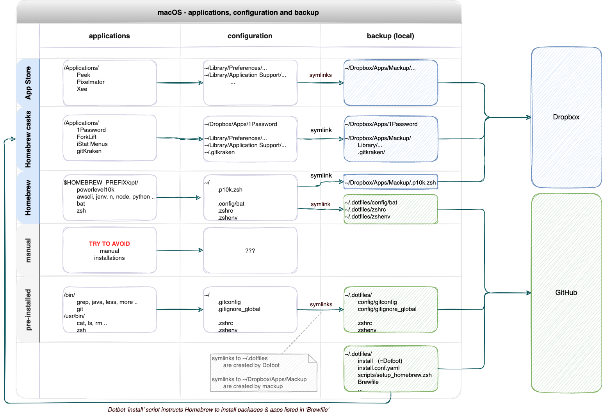

# dotfiles

This project turns a new (or factory reset) MacBook into a fully installed and fully configured development machine.

Up and running within 30 minutes!

It is based on [dotbot](https://github.com/anishathalye/dotbot).

Before you [start using](#usage) it you may want to know [what it does](#overview).

_NB: This project focuses on Java / JavaScript / Python development. But you can easilly tailor it to your needs._

## Usage

### Preparation

* internet connection
* credentials
  * Dropbox
  * 1Password
  * Apple ID (iCloud & App Store)


### Run

1. Fresh macOS install (optional):
   * M1 chip: Use the `Erase All Content and Settings` wizard from the `System Preferences` menu bar.
2. Install Xcode Command Line Utilities (required by git & homebrew):
   ```
   xcode-select --install
   ```
3. Install & execute the .dotfiles project:
   ```
   git clone https://github.com/roelfie/dotfiles.git ~/.dotfiles
   cd ~/.dotfiles
   ./install
   ```
   This will trigger Dotbot to perform all the steps described in [install.conf.yaml](./install.conf.yaml).

_NB: The installation scripts are idempotent so you can run `~/.dotfiles/install` as many times as you wish._


### <a name="manual_steps"></a>Manual steps

* Setup [bookkeeper](./bookkeeper/README.md) as a background job
* System Preferences:
  * BlueTooth: pair keyboard, phone & headphone
  * Keyboard: Use F1, F2, etc. as standard function keys
* Alfred key bindings:
  | app                |  menu                             | hotkey                    | value     |
  |--------------------|----------------------------------|---------------------------|-----------|
  | System Preferences | Keyboard → Shortcuts → Spotlight | Show Spotlight search     | `^ Space` |
  | System Preferences | Keyboard → Shortcuts → Spotlight | Show Finder search window | `⌥ Space` |
  | Alfred             | General                          | Alfred Hotkey             | `⌘ Space` |
  | Alfred             | Features                         | Clipboard History         | `⌥ ⌘ C`   |
  | Alfred             | Features                         | Snippets                  | `⌥ ⌘ S`   |


## Overview

Before we dive into the details, let's have a look at a diagram:



Each MacBook comes with pre-installed software:

* in `/bin`: cat, ls, rm, zsh, ..
* in `/usr/bin`: git, grep, less, more, ..
* in `/Applications`: Mail, Numbers, Pages, Safari, ..
* ...

The user can install additional software:

* with Homebrew (into `/opt/homebrew/opt`) 
* from the App Store (into `/Applications`) 
* or otherwise ...

Configuration files are typically stored somewhere in the user's home directory:

* dotfiles under `~` (like `~/.zshrc` and the `.ssh` folder) 
* under `~/.config`
* under `~/Library` (like `~/Library/Preferences` and `~/Library/Application Support`) 

Installing all this software and restoring (macOS or application) configurations to the settings you are used to, can be a cumbersome task.

Dotbot is all about automating the installation & configuration of your macOS system. 
This dotfiles project is based on dotbot and is specifically tailored to _my_ macOS system. 
But it can be easilly adjusted to your needs.


## What does it do?

This dotfiles project does the following:

1. [Installation](#installation)
2. [Configuration](#configuration)
3. [Backup](#backup) to GitHub (.dotfiles project) & Dropbox (mackup)
4. [Update](#update)


### Installation 

The instructions for Dotbot are defined in [install.conf.yaml](./install.conf.yaml).

When you run `~/.dotfiles/install` the following will be installed (or upgraded):

* [Homebrew](./scripts/setup_homebrew.zsh)
* Homebrew [packages](./Brewfile) and apps
* SSH connection with [GitHub](./scripts/setup_ssh_github.zsh)
* Node (with [n](https://github.com/tj/n)) 
* Java / JDK (with [jenv](https://www.jenv.be/))
* and step-by-step instructions for the user ([example](./scripts/setup_apps_manual.zsh)) in case something can not be automated

_NB: In [zshrc](./zshrc) we've configured the Homebrew `--no-quarantine` flag. This will disable the macOS Gatekeeper, so that an application can be used immediately after installation._

#### Prefer `cask` over `mas`

In [Brewfile](./Brewfile) some GUI macOS applications have the keyword `cask` and some `mas` ([Mac App Store cli](https://github.com/mas-cli/mas)).

* A `cask` is downloaded from a Homebrew repository
* A `mas` is downloaded from the Mac App Store

Some applications are only available as mas; some only as cask; some as both; and some neither as cask nor mas (these must be downloaded & installed manually).

Only applications that have already been _purchased in the App Store_ can be automatically installed using `mas`. If you want to install a paid application for the first time, you have to manually pay for it in & install it from the App Store.

I prefer `cask` over mas, since applications stored in the App Store are tied to one (Apple ID) account, and it is not possible to transfer a purchased app from one account to another. The only drawback of installing as cask is that you will have to upload your license manually after installation.

More info:

```
man brew
brew help bundle
mas help
```


### Configuration

Configuration files are scattered all over the system. 

* dotfiles, like `~/.zshrc` and `~/.gitignore`
* dotfolders, like `~/.ssh` and `~/.config`
* stuff under `~/Library/Preferences`
* stuff under `~/Library/Application Support`
* system preferences 
  * managed using the `defaults` command (see [setup_macos.zsh](./scripts/setup_macos.zsh))
* and more ...

As visualized in the diagram above: 

* some config files are backed up to GitHub (as part of this 'dotfiles' project)
* others are backed up to Dropbox (using [mackup](./scripts/setup_mackup.zsh))

Symlinks are used from the default location to the actual file inside `~/.dotfiles` or `~/Dropbox/Apps/Mackup`. For example: `~/.zshrc -> ~/.dotfiles/zshrc`.


### Backup

As explained in the previous section, configuration files & scripts are stored in either `~/.dotfiles` or `~/Dropbox/Apps/Mackup`. 

* Dotbot restores symlinks from the default locations to the actual files under `~/.dotfiles`
* Mackup ([triggered](./scripts/setup_mackup.zsh) by the dotbot installation) restores symlinks from the default locations to the actual files under `~/Dropbox/Apps/Mackup`.

Some changes to the system are not automatically reflected in `~/.dotfiles` or `~/Dropbox/Apps/Mackup`:

* installing or removing a package with homebrew
  * not automatically reflected in [Brewfile](./Brewfile) !
* installing or removing a VScode extension
  * not automatically reflected in [vscode_extensions](./vscode_extensions) !

For this purpose I have written the [bookkeeper](./bookkeeper/README.md), which periodically re-generates these files and commits them to GitHub.

_NB: Beware that `dotfiles` and `mackup` can overlap. Always make sure that dot-files stored in this `dotfiles` project are excluded from mackup (`[applications_to_ignore]` section in [mackup.cfg](./config/mackup.cfg))._


### Update

The [bookkeeper](./bookkeeper/README.md) updates all installed Homebrew packages and applications. Installing bookkeeper as a background job will automate this for you.

_NB: It is still your own responsibility to upgrade applications that were installed manually or from the App Store!_


## Best practices

* Installation of packages and applications
  * always use homebrew (!!!)
  * use the App Store _only_ if an app is not available as a Homebrew cask
  * try to avoid manual installation of tools or applications (hard to retrace, hard to update)
    * if you do, consider adding it to the [manual steps](#manual_steps) section
* Java
  * use homebrew to (un)install JDKs (see below)
  * use 'jenv' to switch versions
* Node
  * use 'n' to (un)install Node versions
  * use 'n' to switch versions
* Visual Studio Code
  * installation / removal of extensions is automatically backed up to [vscode_extensions](./vscode_extensions) by the bookkeeper; no action required
* Extend bookkeeper 
  * if you discover configuration that can only be _generated_ (like 'Brewfile' and 'vscode_extensions')
* Use mackup (i.e. Dropbox) to backup configuration files containing sensitive information (passwords, email, etc.)
  * do not store them in this .dotfile project!


## HOW TO

### HOW TO - replace pre-installed software with a Homebrew package

MacOS comes with a list of pre-installed tools in `/usr/bin`. 

For example `less`, `keytool`, `more`, `ssh`, `zip`, etc ...

You don't want to mess around with the tools in `/usr/bin`. 

If you want to be able to manage one of these tools with Homebrew (and always use the latest version) you can install the tool alongside the pre-installed one:

```
which -a <pkg>
<pkg> --version

brew search <pkg>
brew install <pkg>
brew info <pkg>

# open a new shell
zsh
which -a <pkg>
<pkg> --version
```

As long as `/opt/homebrew/bin` appears before `/usr/bin` on the `$PATH` the brew version will take precedence. On the last line you should see the newest version (installed with brew) instead of the pre-installed version. See [this example](./README-UDEMY.md) (nano).

### HOW TO - (un)install a JDK

There are detailed [instructions](https://docs.oracle.com/en/java/javase/18/install/installation-jdk-macos.html) on the Oracle website on the installation & removal of a JDK on macOS.

* Installation
  * `brew install --cask oracle-jdk`
  * check that the JDK ends up in `/Library/Java/JavaVirtualMachines`
  * add JDK Home directory to [JAVA_HOME_LOCATIONS](./scripts/setup_java.zsh) in `setup_java.sh`
    * Example: `/Library/Java/JavaVirtualMachines/jdk-18.jdk/Contents/Home`
  * re-run `~/.dotfiles/setup_java.sh` to have the new JDK version added to jenv
* Removal
  * `brew uninstall --cask oracle-jdk`
  * remove JDK Home directory from [JAVA_HOME_LOCATIONS](./scripts/setup_java.zsh) in `setup_java.sh`
  * remove symlink manually from `~/.jenv/versions`

_NB: the `oracle-jdk` cask has no version name. How to install multiple Oracle JDK versions alongside each other?_

## References

* [dotfiles](https://dotfiles.github.io/)
* [Dotfiles from Start to Finish-ish](https://www.udemy.com/course/dotfiles-from-start-to-finish-ish/) - course (Udemy)
* [Patrick McDonalds dotfiles repo](https://github.com/eieioxyz/dotfiles_macos) - github
* [Youtube](https://www.youtube.com/watch?v=kIdiWut8eD8)
* defaults command:
  * [macos-defaults.com](https://macos-defaults.com/)
  * Blog post on [cfprefsd](https://eclecticlight.co/2019/08/22/working-safely-and-effectively-with-preferences-in-mojave/)
  * [macOS Prefs Editor](http://apps.tempel.org/PrefsEditor/index.php)
  * Example of a [script with lots of defaults](https://github.com/mathiasbynens/dotfiles/blob/main/.macos)
  * More info on the defaults command:
    ```
    man defaults
    defaults help
    ```
