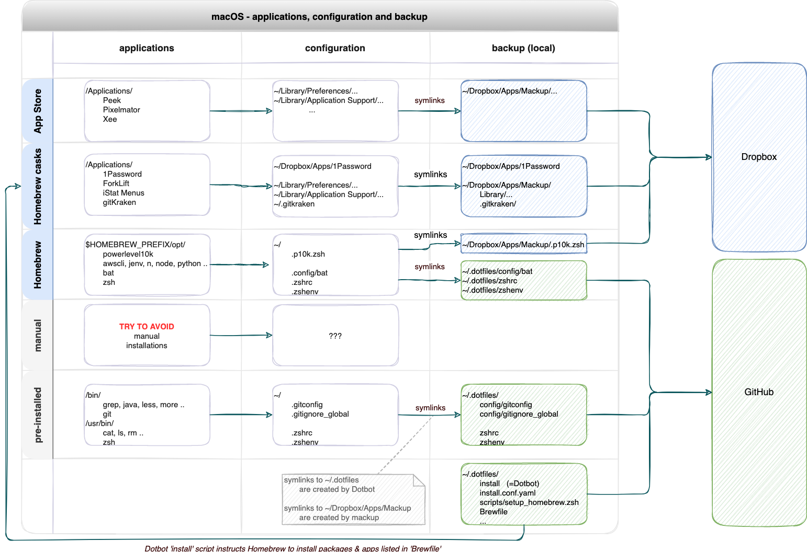

# dotfiles

This project turns a new (or factory reset) MacBook into a fully installed and fully configured development machine.

Up and running within 30 minutes!

It is based on [dotbot](https://github.com/anishathalye/dotbot).

Before you [start using](#usage) it you may want to know [what it does](#overview).

_NB: This project focuses on Java / JavaScript / Python development. But you can easilly tailor it to your needs._

## Usage

### Preparation

* internet connection
* credentials
  * Dropbox
  * 1Password
  * Apple ID (iCloud & App Store)


### Run

1. Fresh macOS install (optional):
   * M1 chip: Use the `Erase All Content and Settings` wizard from the `System Preferences` menu bar.
2. Install Xcode Command Line Utilities (required by git & homebrew):
   ```
   xcode-select --install
   ```
3. Install & execute the .dotfiles project:
   ```
   git clone https://github.com/roelfie/dotfiles.git ~/.dotfiles
   cd ~/.dotfiles
   ./install
   ```
   This will trigger Dotbot to perform all the steps described in [install.conf.yaml](./install.conf.yaml).

_NB: The installation scripts are idempotent so you can run `~/.dotfiles/install` as many times as you wish._


### <a name="manual_steps"></a>Manual steps

* Setup [bookkeeper](./bookkeeper/README.md) as a background job
* System Preferences:
  * BlueTooth: pair keyboard, phone & headphone
  * Keyboard: Use F1, F2, etc. as standard function keys
* Alfred key bindings:
  | app                |  menu                             | hotkey                    | value     |
  |--------------------|----------------------------------|---------------------------|-----------|
  | System Preferences | Keyboard → Shortcuts → Spotlight | Show Spotlight search     | `^ Space` |
  | System Preferences | Keyboard → Shortcuts → Spotlight | Show Finder search window | `⌥ Space` |
  | Alfred             | General                          | Alfred Hotkey             | `⌘ Space` |
  | Alfred             | Features                         | Clipboard History         | `⌥ ⌘ C`   |
  | Alfred             | Features                         | Snippets                  | `⌥ ⌘ S`   |
* Configure the menu bar:
  

## Overview

Before we dive into the details, let's have a look at a diagram:



Each MacBook comes with pre-installed software:

* in `/bin`: cat, ls, rm, zsh, ..
* in `/usr/bin`: git, grep, less, more, ..
* in `/Applications`: Mail, Numbers, Pages, Safari, ..
* ...

The user can install additional software:

* with Homebrew (into `/opt/homebrew/opt`) 
* from the App Store (into `/Applications`) 
* with `npm` or `pip` (omitted in diagram)
* or otherwise ...

Configuration files are typically stored somewhere in the user's home directory:

* dotfiles, like `~/.zshrc` and `~/.gitignore`
* dotfolders, like `~/.ssh` and `~/.config`
* under `~/Library` (like `~/Library/Preferences` and `~/Library/Application Support`) 

Installing all this software and restoring (macOS or application) configurations to the settings you are used to, can be a cumbersome task.

### Dotbot & bookkeeper 

Dotbot is all about automating the installation & configuration of your macOS system. 
This dotfiles project is based on dotbot and is specifically tailored to _my_ macOS system. 
But it can be easilly adjusted to your needs.

Dotbot is _not_ about keeping the software on your system up-to-date. It is also _not_ about automatically backing up changes to your system. This is why I have added the 'bookkeeper' to this project.


## What does it do?

This dotfiles project does the following:

1. [Installation](#installation)
2. [Configuration](#configuration)
3. [Backup](#backup) to GitHub (.dotfiles project) & Dropbox (mackup)
4. [Update](#update)


### Installation 

The instructions for Dotbot are defined in [install.conf.yaml](./install.conf.yaml).

When you run `~/.dotfiles/install` the following will be installed (or upgraded):

* package managers & packages
  |                                          | version manager                         | package manager  | backup                                                         |
  |------------------------------------------|-----------------------------------------|------------------|----------------------------------------------------------------|
  | [Homebrew](./scripts/setup_homebrew.zsh) | -                                       | brew             | [Brewfile](./Brewfile)                                         |
  | [Node](./scripts/setup_node.zsh)         | [n](https://github.com/tj/n)            | npm              | [npm.global.txt](./backup/npm.global.txt)                      |
  | [Python](./scripts/setup_python.zsh)     | [pyenv](https://github.com/pyenv/pyenv) | pip              | [pip.requirements.txt](./backup/pip.requirements.txt)          |
* [Java](./scripts/setup_java.zsh) & [jenv](https://www.jenv.be/)
* SSH connection with [GitHub](./scripts/setup_ssh_github.zsh)
* and step-by-step instructions for the user ([example](./scripts/setup_apps_manual.zsh)) in case something can not be automated

_NB: In [zshrc](./zshrc) we've configured the Homebrew `--no-quarantine` flag. This will disable the macOS Gatekeeper, so that an application can be used immediately after installation._

#### Prefer `cask` over `mas`

In [Brewfile](./Brewfile) some GUI macOS applications have the keyword `cask` and some `mas` ([Mac App Store cli](https://github.com/mas-cli/mas)).

* A `cask` is downloaded from a Homebrew repository
* A `mas` is downloaded from the Mac App Store

Some applications are only available as mas; some only as cask; some as both; and some neither as cask nor mas (these must be downloaded & installed manually).

Only applications that have already been _purchased in the App Store_ can be automatically installed using `mas`. If you want to install a paid application for the first time, you have to manually pay for it in & install it from the App Store.

I prefer `cask` over mas, since applications stored in the App Store are tied to one (Apple ID) account, and it is not possible to transfer a purchased app from one account to another. The only drawback of installing as cask is that you will have to upload your license manually after installation.

More info: `man brew` / `brew help bundle` / `mas help`

#### Command line tools

Some casks are shipped with command line tools. Brew installs (symlinks) them in `/opt/homebrew/bin`:

```
$ ls -la /opt/homebrew/bin | grep /Applications/
  bcomp -> /Applications/Beyond Compare.app/Contents/MacOS/bcomp*
  code -> /Applications/Visual Studio Code.app/Contents/Resources/app/bin/code*
  stree -> /Applications/Sourcetree.app/Contents/Resources/stree*
  ...
```

Since this folder is in the `$PATH` these tools are automatically available.


### Configuration

Configuration files are scattered all over the system. 

* dotfiles & dotfolders under `~`
* stuff under `~/Library/...`
* system preferences (managed using the [`defaults`](./scripts/setup_macos.zsh) command)
* ...

We use two means of backing up config files (no 100% coverage):

| tool                                 | storage | how      | example                                                                                                                |
|--------------------------------------|---------|----------|------------------------------------------------------------------------------------------------------------------------|
| .dotfiles                            | GitHub  | symlinks | `~/Library/Preferences/com.apple.Terminal.plist -> ~/Dropbox/Apps/Mackup/Library/Preferences/com.apple.Terminal.plist` |
| [mackup](./scripts/setup_mackup.zsh) | Dropbox | symlinks | `~/.zshrc -> ~/.dotfiles/zshrc`                                                                                        |


### Backup

Beware that `dotfiles` and `mackup` can overlap. Always make sure that dot-files stored in this `dotfiles` project are excluded from mackup (`[applications_to_ignore]` section in [mackup.cfg](./config/mackup.cfg)).

Not all changes to the system are automatically (via symlinks) reflected in `~/.dotfiles` or `~/Dropbox/Apps/Mackup`:

* (un)installing packages with homebrew
* (un)installing packages with pip
* (un)installing packages with npm
* (un)installing Visual Studio Code extensions

That's what [bookkeeper](./bookkeeper/README.md) is for. Bookkeeper periodically re-generates backup files for installed homebrew, pip & npm packages. And commits them to GitHub.


### Update

In addition to generating backup files, [bookkeeper](./bookkeeper/README.md) also updates all outdated homebrew / npm / pip packages and applications. Installing bookkeeper as a background job will automate this for you.

_NB: It is still your own responsibility to upgrade applications that were installed from the App Store (or otherwise bypassed the standard package managers)._


## Best practices

* avoid manual installation of tools or apps
  * if you do, consider adding it to the [manual steps](#manual_steps) section
  * use the App Store _only_ if an app is not available as a Homebrew cask
* extend bookkeeper where possible
  * for stuff that can not be automatically backed up (like brew/npm/pip packages & vscode extensions)
* use mackup (i.e. Dropbox) to backup configuration files containing sensitive information (passwords, email, etc.)
  * do not store them in this .dotfile project!

### Package management (homebrew, node, python)

|          | package manager               | install                                  | uninstall                      | target              |
|----------|-------------------------------|------------------------------------------|--------------------------------|---------------------|
| homebrew | brew                          | `brew install <pkg>`                     | `brew uninstall <pkg>`         | `/opt/homebrew/opt` |
| node     | [npm](https://www.npmjs.com/) | `npm install --global <pkg>[@<version>]` | `npm uninstall --global <pkg>` | `~/.n/bin`          |
| python   | [pip](https://pip.pypa.io/)   | `pip install <pkg>[==<version>]`         | `pip-autoremove <pkg>` (*)     | `pip show <pkg>`    |


(*) `pip uninstall` does not uninstall (unused) dependencies. `pip-autoremove` does.

Useful pip commands:

```
pip list
pip show <pkg>
# Show package dependencies:
pip show <pkg> | grep ^Required-by
```

See the 'HOW TO' below on how to install a specific version of a package (instead of the latest version) with brew, npm and pip.

### Version management (java, node, python)

* Java
  * use homebrew to (un)install JDKs (see below)
  * use [jenv](https://www.jenv.be/) to switch versions
* Node
  * use [n](https://github.com/pyenv/pyenv#usage) to (un)install Node versions
  * use n to switch Node versions
* Python
  * use [pyenv](https://github.com/pyenv/pyenv#usage) to (un)install python versions
  * use pyenv to switch python versions


## HOW TO

### HOW TO - install a specific package version

|          | search                      | show versions              | install version                             |
|----------|-----------------------------|----------------------------|---------------------------------------------|
| homebrew | `brew search <pkg>`         | `brew search <pkg>`        | `brew install <pkg>@<version>` (*)          |
| node     | `npm search <pkg>`          | `npm show <pkg> versions`  | `npm install --global <pkg>@<version>` (**) |
| python   | `poetry search <pkg>` (***) | `pip index versions <pkg>` | `pip install <pkg>==<version>` (**)         |

(*) _Homebrew has limited support for installing old versions. It does [support multiple versions](https://docs.brew.sh/Versions) with a special naming format, but most packages are available only as most recent version. Some packages (like openjdk, postgresql, python, ..) are available in older versions (openjdk@11, openjdk@17, ..)._

(**) _with npm and pip it's only possible to install one version at a time. If you do `npm install --global <pkg>@<2nd_version>` or `pip install <pkg>==<2nd_version>` packages that are already installed will be removed._

(***) _`pip search` is deprecated. You can either use poetry, or search online at https://pypi.org/ (Python Package Index)._


### HOW TO - replace pre-installed software with a Homebrew package

MacOS comes with a list of pre-installed tools in `/usr/bin`. 

For example `less`, `keytool`, `more`, `ssh`, `zip`, etc ...

You don't want to mess around with the tools in `/usr/bin`. 

If you want to be able to manage one of these tools with Homebrew (and always use the latest version) you can install the tool alongside the pre-installed one:

```
which -a <pkg>
<pkg> --version

brew search <pkg>
brew install <pkg>
brew info <pkg>

# open a new shell
zsh
which -a <pkg>
<pkg> --version
```

As long as `/opt/homebrew/bin` appears before `/usr/bin` on the `$PATH` the brew version will take precedence. 
On the last line you should see the newest version (installed with brew) instead of the pre-installed version. 
See [this example](./resources/doc/README-UDEMY.md) (nano).

### HOW TO - (un)install a JDK

Situation May 2022.

#### Installing a JDK

|   |                                    | Oracle JDK                                        | OpenJDK                                           |
|---|------------------------------------|---------------------------------------------------|---------------------------------------------------|
| 1 | choose jdk version                 | `oracle-jdk`                                      | `openjdk` and `openjdk@<lts>` (*)                 |
| 2 | install jdk                        | `brew install oracle-jdk`                         | `brew install openjdk@<version>`                  |
| 3 | /Library/Java/JavaVirtualMachines/ | symlink created automatically                     | create symlink manually (**)                      |
| 4 | add jdk to `JAVA_HOME_LOCATIONS`   | update [setup_java.zsh](./scripts/setup_java.zsh) | update [setup_java.zsh](./scripts/setup_java.zsh) |
| 5 | add jdk to `jenv`                  | run [setup_java.zsh](./scripts/setup_java.zsh)    | run [setup_java.zsh](./scripts/setup_java.zsh)    |

(*) _Oracle JDK comes in just one version (most recent). For OpenJDK also some recent LTS (long term support) versions can be installed (8, 11, 17)._

(**) _When you install the Oracle JDK a symlink from /Library/Java/JavaVirtualMachines to /opt/homebrew/opt is automatically created. When you install openjdk you will have to create the symlink manually. Do `brew info openjdk@17` for more information._

#### Removing a JDK

  * `brew uninstall openjdk@17`
  * remove JDK from [JAVA_HOME_LOCATIONS](./scripts/setup_java.zsh) in `setup_java.sh`
  * remove symlink from `~/.jenv/versions`
  * remove symlink from `/Library/Java/JavaVirtualMachines`

## References

* [Dotbot](https://github.com/anishathalye/dotbot)
* [Dotfiles](https://dotfiles.github.io/)
* [Dotfiles from Start to Finish-ish](https://www.udemy.com/course/dotfiles-from-start-to-finish-ish/) (Udemy)
* [Dotfiles repo](https://github.com/eieioxyz/dotfiles_macos) example (github)
* [Youtube](https://www.youtube.com/watch?v=kIdiWut8eD8)
* defaults command:
  * [macos-defaults.com](https://macos-defaults.com/)
  * [cfprefsd](https://eclecticlight.co/2019/08/22/working-safely-and-effectively-with-preferences-in-mojave/)
  * [macOS Prefs Editor](http://apps.tempel.org/PrefsEditor/index.php)
  * Example of a [script with lots of defaults](https://github.com/mathiasbynens/dotfiles/blob/main/.macos)
  * More info on the defaults command:
    ```
    man defaults
    defaults help
    ```
