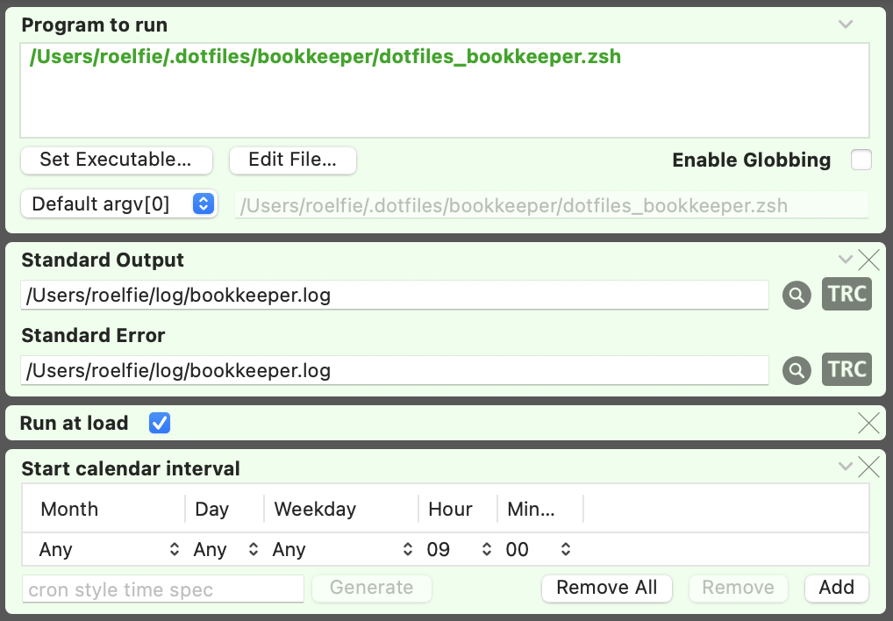

# LaunchControl

The [dotfiles_bookkeeper](./dotfiles_bookkeeper.zsh) can be scheduled as a daily job with [launchd](https://en.wikipedia.org/wiki/Launchd).

I use [LaunchControl](https://www.soma-zone.com/LaunchControl) to configure the bookkeeper job and load it into launchd.

## Configure LaunchControl

On the Utilities tab in the LaunchControl preferences, select

* Enable QuickLaunch
* Enable JobWatch

## Configure bookkeeper job

In the LaunchControl main window

* Select `User Agents`
* Create a new User Agent (`+` button)
* Configure the `dotfiles_bookkeeper` job and click on the `load` button:

The job is now loaded into launchd and will run every X hours.

## QuickLaunch

In QuickLaunch (accessible from the menu bar), add the bookkeeper job to the favorites:

You can now easilly access the job from the menu bar:

You can unload it from launchd, or you can also run the job 'on demand'...
