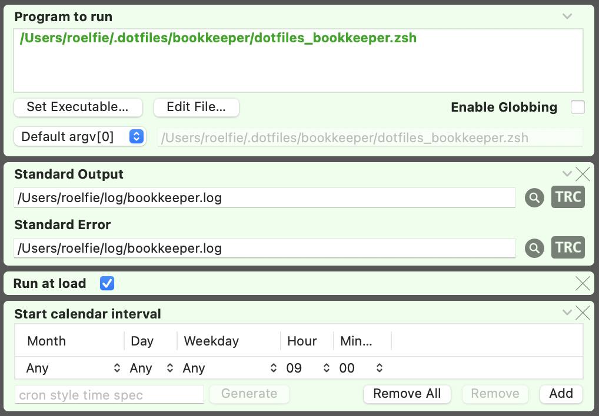
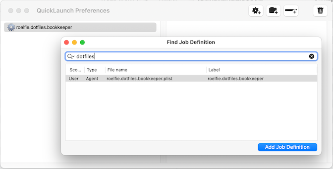
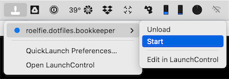

# Bookkeeper

## What is it?

The bookkeeper is a [script](./dotfiles_bookkeeper.zsh) that does a couple of things:

* Keep the system up-to-date (brew packages)
* Keep the .dotfiles project up-to-date (brewfile, vscode extensions)
* Commit & push simple changes to the .dotfiles project to GitHub
* Ask the user to review complex changes to the .dotfile project & commit them manually

By scheduling the bookkeeper to run periodically, you (the macOS user) don't have to think about keeping 
the .dotfiles project up-to-date anymore; the bookkeeper will (only) notify you when you need to take action.

## LaunchControl

There are several ways to schedule a job on macOS. The recommended way is using [launchd](https://en.wikipedia.org/wiki/Launchd).

I use [LaunchControl](https://www.soma-zone.com/LaunchControl) to configure the bookkeeper job and load it into launchd.

### Configure LaunchControl

On the Utilities tab in the LaunchControl preferences, select

* Enable QuickLaunch
* Enable JobWatch

### Configure bookkeeper job

In the LaunchControl main window

* Select `User Agents`
* Create a new User Agent (`+` button)
* Configure the `dotfiles_bookkeeper` job and click on the `load` button:

The job is now loaded into launchd and will run every X hours. Missed runs (because the macbook was turned off) will not be retried.

### QuickLaunch

In QuickLaunch (accessible from the menu bar), add the bookkeeper job to the favorites:

You can now easilly access the job from the menu bar:

You can load/unload the job from launchd, or you can run it 'on demand'...
